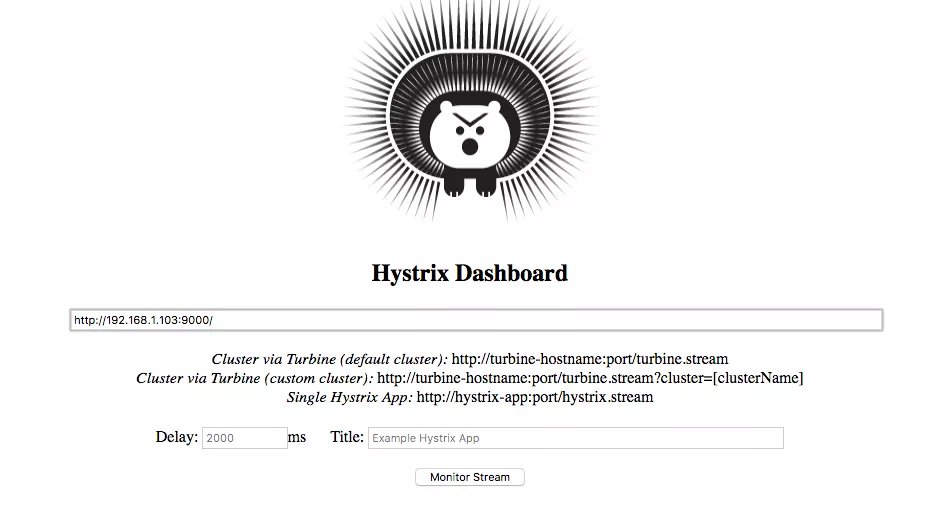
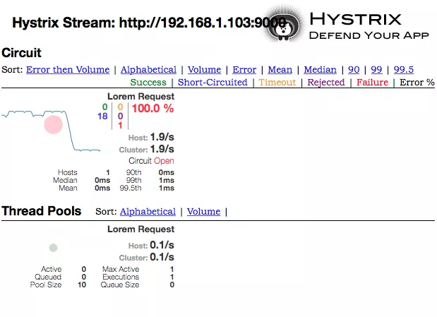
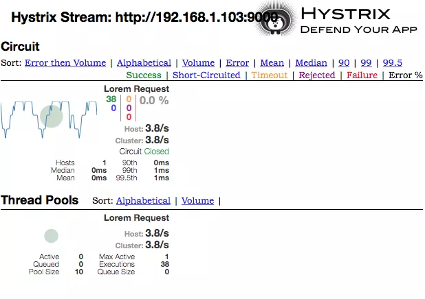
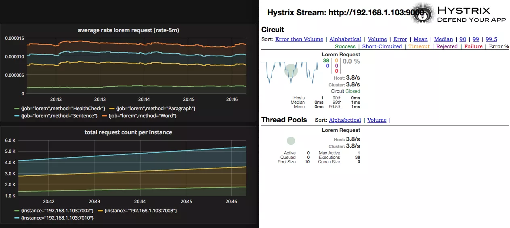

# 8. go-kit Hystrix 断路器

参考文章

1. [Micro-services Using go-kit: Hystrix Circuit Breaker](http://www.ru-rocker.com/2017/04/24/micro-services-using-go-kit-hystrix-circuit-breaker/)

应用断路器模式的目的, 是在服务出现延迟或错误时进行保护和控制, 以防止在分布式环境中出现连锁故障. 另外, ta还为我们的服务提供快速失败和快速恢复的功能.

## 1. 概览

在我前面的文章中, 我写了很多关于服务监控的东西. 添加监控的目的在于, 无论什么时候我们发现了问题, 都可以迅速且准确地追踪到. 但有时这仍然是不够的. 现在假设我们的服务出现了问题, 监控工具也发现并发出了警报. 当我们在调查或者修复这个问题时, 必定会出现大量请求错误, 可能会在多个系统间引发连锁故障. 当然, 这里假设我们的服务请求量可达到300/秒的程度.

## 2. 断路器模式

为了解决上面提到的问题, 我们可以使用断路器模式. 应用断路器模式的目的是当请求出错错误时, 能够优雅的降低服务功能. 断路器模式保障了微服务可以在关联服务出现问题时继续运行, 同时也给了故障服务恢复的时间.

go-kit本身提供了3种断路器工具库, 分别是

- [gobreaker](http://godoc.org/github.com/sony/gobreaker)
- [handybreaker](http://godoc.org/github.com/streadway/handy/breaker)
- [hystrix](https://godoc.org/github.com/afex/hystrix-go/hystrix)

本文介绍的是`Hystrix`.

以下引用自`Hystrix`的wiki:

> `Hystrix`是一个在这些分布式的服务间添加"延时容许"和"错误容许"逻辑的工具库, ta会帮助你控制分布式服务间的通信. `Hystrix`通过隔离服务间的接入点, 停止ta们间的级联错误, 并且提供fallback选项, 提高了系统的整体自愈能力.

> 译者注: 这翻译好废啊...

## 3. 应用场景

本文我将在`Lorem`服务中添加`Hystrix`库来实现断路器模式. 当回路处于断路状态时, 我将展示"Service currently unavailable "的消息. 当然, 这个信息可以随你的需求自由改动. 另外, `Hystrix`库每隔一段时间就会尝试重连相关服务以检查其是否可用, 如果请求成功, 那么整个回路就又处于连通状态了.

拷贝`lorem-consul`目标, 重命名为`lorem-hystrix`.

## 4. 一步一步来

开始之前, 要先下载必需的依赖库

```
# Download required libraries
go get github.com/afex/hystrix-go/hystrix
```

### 4.1 `circuitbreaker.go`

首先创建一个名为`circuitbreaker.go`的文件, 在这个文件中创建一个名为`Hystrix`的函数. ta接受3个参数: 命令名, fallback信息和日志对象, 然后返回`endpoint.Middleware`对象. 这样的操作是必须的, 因为我想链式调用endpoint函数.

```go
func Hystrix(commandName string, fallbackMesg string, logger log.Logger) endpoint.Middleware {
	return func(next endpoint.Endpoint) endpoint.Endpoint {
		return func(ctx context.Context, request interface{}) (response interface{}, err error) {
			var resp interface{}
			if err := hystrix.Do(commandName, func() (err error) {
				resp, err = next(ctx, request)
				return err
			}, func(err error) error {
				logger.Log("fallbackErrorDesc", err.Error())
				resp = struct {
					Fallback string `json:"fallback"`
				}{
					fallbackMesg,
				}
				return nil
			}); err != nil {
				return nil, err
			}
			return resp, nil
		}
	}
}
```

基本上, 我只利用go-kit提供的hystrix函数, 以便提供回退消息和日志记录功能.

### 4.2 `discover/main.go`

在这一步, 先配置`Hystrix`命令以完成回路设置, 然后瘵已经存在的`Lorem`endpoint端点传入`Hystrix`函数.

```go
// configure hystrix
hystrix.ConfigureCommand("Lorem Request", hystrix.CommandConfig{Timeout: 1000})
loremEndpoint = lorem_hystrix.Hystrix("Lorem Request", 
  "Service currently unavailable", logger)(loremEndpoint)
```

接下来, 配置`Hystrix`流处理函数, 并使之运行在9000端口. 如果我们希望能实时展示度量数据, 这一步是必须的. 展示的信息将显示在`Hystrix`仪表盘中.

```go
// configure the hystrix stream handler
hystrixStreamHandler := hystrix.NewStreamHandler()
hystrixStreamHandler.Start()
go func() {
  errc <- http.ListenAndServe(net.JoinHostPort("", "9000"), hystrixStreamHandler)
}()
```

### 4.3 执行

在执行前, 我们需要将启动`consul agent`和`Hystrix`仪表盘.

```
# consul
docker run --rm -p 8400:8400 -p 8500:8500 -p 8600:53/udp -h node1 progrium/consul -server -bootstrap -ui-dir /ui

# hystrix
docker run -p 8181:9002 --name hystrix-dashboard mlabouardy/hystrix-dashboard:latest
```

我使用`mlabouardy/hystrix-dashboard`的docker镜像来运行`Hystrix`仪表盘, 可以通过`http://localhost:8181/hystrix`访问.

接下来启动3个`Lorem`服务实例

```
# start three lorem services in port 7002 7003 7010. 
# Each runs in separate terminal
cd $GOPATH/src/github.com/ru-rocker/gokit-playground

go run lorem-hystrix/lorem-hystrix.d/main.go \
   -consul.addr localhost -consul.port 8500 \
   -advertise.addr 192.168.1.103 -advertise.port 7002

go run lorem-hystrix/lorem-hystrix.d/main.go \
   -consul.addr localhost -consul.port 8500 \
   -advertise.addr 192.168.1.103 -advertise.port 7003

go run lorem-hystrix/lorem-hystrix.d/main.go \
   -consul.addr localhost -consul.port 8500 \
   -advertise.addr 192.168.1.103 -advertise.port 7010
```

然后是客户端

```
# client
cd $GOPATH/src/github.com/ru-rocker/gokit-playground
go run lorem-hystrix/discover.d/main.go \
   -consul.addr localhost -consul.port 8500
```

为了展示断路器工作正常, 且能够显示fallback信息, 这里以循环形式发起请求.

```
# execute in forever loop
# each runs in separate terminal
while true; do curl -XPOST -d'{"requestType":"word", "min":10, "max":10}' http://localhost:8080/sd-lorem; sleep 1; done;
while true; do curl -XPOST -d'{"requestType":"sentence", "min":10, "max":10}' http://localhost:8080/sd-lorem; sleep 1; done;
while true; do curl -XPOST -d'{"requestType":"paragraph", "min":10, "max":10}' http://localhost:8080/sd-lorem; sleep 1; done;
```

现在可以通过关闭所有3个实例来验证, 几秒钟过后, 再重新启动ta们. 你可以看到如下类似的信息.

```
# sample output
{"message":"curiosarum"}
{"message":"caecitatem"}
{"fallback":"Service currently unavailable"}
{"fallback":"Service currently unavailable"}
{"message":"nonnullius"}
```

### 4.4 配置Hystrix仪表盘



在Hystrix仪表盘中, 唯一的配置项目就是输入Hystrix流处理器的URL(第2步提到过). 这里我输入`http://192.168.1.103:9000/`, 然后点击`Monitor Stream`开始实时监控.

下面是我停止/启动`Lorem`服务几次后, 仪表盘的几张截图.







## 5. 总结

断路器是一种可以让服务拥有弹性和自愈能力的设计模式. 因为这种方式的容错机制, 可以避免在分布式环境中出现的级联故障.

go-kit本身提供了3个断路器工具库. 我决定使用`Hystrix`而不是另外的原因是, ta提供了dashboard控制面板. 当然, 也有可能是我错了, 有可能`gobreaker`或`handybreaker`也有了ta们的控制面板. 我对此接受任何讨论.

本文到这里就结束了. 你可以在我的[github](https://github.com/ru-rocker/gokit-playground)查看本文用到的代码, 就在`lorem-hystrix`目录下.

PS: 如果你想了解更多关于断路器的设计模式, 可以查看这篇Martin Fowler写的优秀的[文章](https://martinfowler.com/bliki/CircuitBreaker.html)

## 6. 参考

- [Circuit Breaker Pattern](https://martinfowler.com/bliki/CircuitBreaker.html)
- [Hystrix Wiki](https://github.com/Netflix/Hystrix/wiki)
- [Spring Boot Circuit Breaker Pattern](https://spring.io/guides/gs/circuit-breaker)
