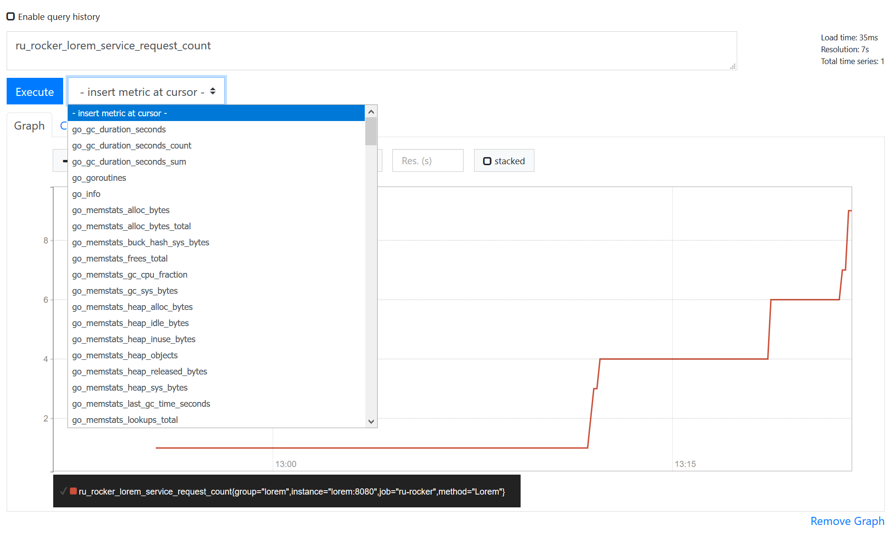
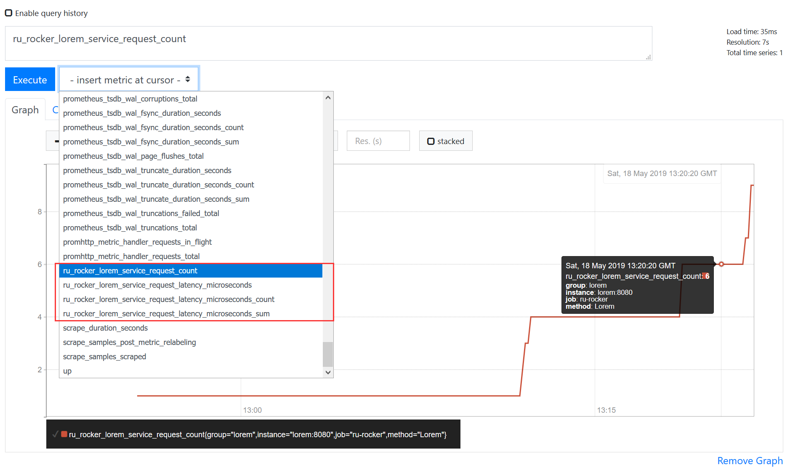

此工程为[ru-rocker/gokit-playground](https://github.com/ru-rocker/gokit-playground/tree/master/lorem-metrics)的精简版, 移除了日志, 及错误处理部分的代码, 将原来业务逻辑的3个方法合并成了1个, 与后面用到的示例保持统一, 并添加了详细注释.

原作中此示例代码基于限流示例, 本例中将限流部分移除, 同时也移除了日志中间件, 以展现监控中间件最核心的使用方法.

首先构建项目的依赖镜像(只是下载项目依赖包)

```
docker build --no-cache=true -f dep.dockerfile -t gokit-lorem-monitor-01 .
```

然后通过`docker-compose`启动.

```
docker-componse up -d
```

由于是开发环境, 所以将项目路径挂载到容器中, 修改代码后重启服务就可以看到效果, 不用重新构建.

项目启动后, 正常的访问结果如下

```
$ curl -XPOST localhost:8080/lorem/word/1/20
{"message":"difficultates"}

$ curl -XPOST localhost:8080/lorem/sentence/1/20
{"message":"Concurrunt nota re dicam fias sim aut pecco die appetitum ea mortalitatis hi."}

$ curl -XPOST localhost:8080/lorem/paragraph/1/20
{"message":"Tibi ita recedimus an aut eum tenacius quae mortalitatis eram aut rapit montium inaequaliter dulcedo. Contra rerum tempus mala, anima volebant dura quae o. Sonuerit nomen nam da nuntii. Talibus re pro me audio. Deum temptatione imperas da vi, an da cuius facere valeam e tua qui video te psalmi agam. Me indicabo te tuetur audi. Mirabilia amor primus aboleatur, te, meque mundatior deserens da contexo e suaveolentiam. Aut ita sensarum nuda eripietur superbam isto ab, sana tu ita ore siderum. Lux horum an ore nam, dicens ore curiosarum filiorum eruuntur, munerum displicens. Temptationem cor plena modi agito, inlusio, deo fama propterea ab persentiscere nam acceptam sed e a corruptione re. Ea nascendo qui fuit ceterarumque me odorem amem genus odor, pecco re quiescente occursantur semper."}
```

Prometheus与Grafana的操作方法可以见原作或译文, 这里不过多讲述(版本不同, 多少会有些出入, 好在基本操作不复杂, 稍微摸索一下就能配置成功).

## 关于Prometheus

以前只是听说过ta的大名, 但没有实际用过. 这个示例是我第一次尝试.

我大概知道一些其他的监控系统, Zabbix, Nagios, cacti. ta们都提供了类似的功能, 监控端口在线状态以判断服务是否正常, 监控端口/主机/交换机流量判断是否有非法请求, 使用适配各系统的插件(比如shell脚本)收集并监控物理主机的资源占用状态等, 并以这些特性为基础, 衍生出来的诸如机房分组, 配置管理等功能.

ELK则是一整套工具集, 用于拉取程序打印的日志, 集中处理并备份, 然后通过Web界面展现, 同时提供类似sql的查询表达式, 可以做各种聚合操作, 其结果也可以以各种图表形象地展示出来.

但是ta们共同的特点就是不会对程序代码有任何影响, 运维同学做的监控对开发同学来说是透明的. 

而Prometheus则不同, 在本示例的代码可以看到, ta明显是在程序中做了埋点操作, 然后提供了一个对外访问的接口.

虽然我们的代码里, 只使用了Prometheus监控服务中的指定方法, 但是在访问Prometheus的web界面时, 发现可选荐有如下种类.





我们提供了两个监测点, 但实际上Prometheus可监控了项目很多, 包括GC, 内存使用, goroutine, CPU, 网络数据等各种信息(都有效哦)...

我们引用的是Prometheus的golang版本客户端, 当然还有其他语言的客户端, 这些客户端根据语言不同监控程序本身的资源占用等信息. 我们在docker-compose中运行的prometheus才算是服务本体.

## 关于Grafana
